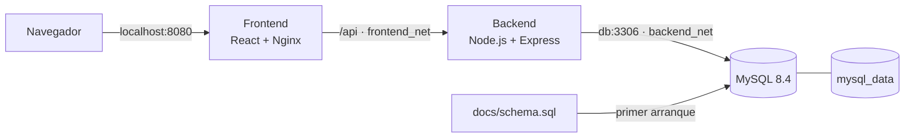

# Docker Repair Equipment System

Sistema web para gestionar clientes, equipos, técnicos, órdenes, pagos y
usuarios. Esta versión se centra en demostrar la contenerización, seguridad,
topología y despliegue reproducible de una aplicación full stack.

## Arquitectura



| Servicio | Imagen | Usuario final | Redes | Puerto publicado |
|---|---|---|---|---|
| frontend | Construida desde `frontend/Dockerfile` | `nginx` | `frontend_net` | `8080:8080` |
| backend | Construida desde `backend/Dockerfile` | `node` | Ambas | Ninguno |
| db | `mysql:8.4` | Gestionado por la imagen oficial | `backend_net` | Ninguno |

Solo Nginx es accesible desde el host. Backend conecta las dos capas y MySQL
permanece en una red marcada como interna.

Documentación ampliada:

- [Arquitectura y decisiones](docs/architecture.md)
- [Postura de seguridad](docs/security.md)
- [Backend](backend/README.md)
- [Frontend](frontend/README.md)

## Estructura Docker

```text
.
├── docker-compose.yml
├── .env.example
├── backend/
│   ├── src/
│   ├── Dockerfile
│   ├── .dockerignore
│   ├── .env.example
│   └── README.md
├── frontend/
│   ├── src/
│   ├── Dockerfile
│   ├── .dockerignore
│   ├── .env.example
│   ├── nginx.conf
│   └── README.md
├── docs/
│   ├── architecture.md
│   ├── security.md
│   └── schema.sql
└── scripts/
    └── verify-docker.sh
```

## Cómo se construyeron las imágenes

### Backend

`backend/Dockerfile` tiene dos etapas:

1. **dependencies:** instala solo dependencias de producción con
   `npm ci --omit=dev`.
2. **runtime:** recibe las dependencias y el código usando
   `COPY --chown=node:node`.

La etapa final declara `USER node`. Separar la instalación de la ejecución
mejora la caché de capas y asegura que las herramientas o archivos temporales
de construcción no se mezclen con el código final.

Se eligió `node:22-alpine` por su tamaño reducido y porque la aplicación no
requiere bibliotecas nativas adicionales.

### Frontend

`frontend/Dockerfile` aplica una construcción multietapa más marcada:

1. Node.js y Vite compilan React y generan `dist`.
2. Nginx recibe únicamente los archivos estáticos de `dist`.

Node, npm, el código fuente y las dependencias de desarrollo no quedan en la
imagen final. Nginx escucha en 8080 para no necesitar privilegios y declara
`USER nginx`.

### Contextos de construcción

Cada componente tiene su propio `.dockerignore`. Se excluyen:

- `node_modules/`
- `dist/` y `coverage/`
- `.env` y sus variantes
- `.git/` y `.vite/`
- registros y artefactos locales

`.env.example` se conserva como documentación, pero los archivos reales con
secretos nunca entran a las imágenes.

## Nginx como proxy inverso

El navegador utiliza rutas relativas como `/api/auth/login`. Nginx decide
cómo atenderlas:

- `/api/*` se redirige a `http://backend:3001`.
- El resto sirve el frontend compilado.
- `try_files ... /index.html` permite las rutas de la SPA.

Así, el backend no se publica y el navegador no depende de IP internas.

## Docker Compose

[docker-compose.yml](docker-compose.yml) declara el sistema completo:

- Construye frontend y backend.
- Descarga la imagen oficial de MySQL.
- Crea las redes `frontend_net` y `backend_net`.
- Crea el volumen `mysql_data`.
- Inyecta las variables en tiempo de ejecución.
- Aplica `no-new-privileges:true`.
- Controla el orden mediante healthchecks.

### Garantías de arranque

```text
MySQL carga docs/schema.sql
          ↓ healthcheck consulta la tabla roles
Backend crea el administrador e inicia Express
          ↓ healthcheck consulta /api/health y MySQL
Frontend inicia Nginx
          ↓ healthcheck solicita el puerto 8080
Sistema disponible
```

`depends_on` utiliza `condition: service_healthy`; no basta con que el
contenedor exista, el servicio debe responder.

## Persistencia e inicialización

```yaml
volumes:
  - mysql_data:/var/lib/mysql
  - ./docs/schema.sql:/docker-entrypoint-initdb.d/01-schema.sql:ro
```

- `mysql_data` mantiene la información al recrear contenedores.
- `schema.sql` crea tablas y catálogos cuando el volumen está vacío.
- El montaje `:ro` impide que MySQL modifique el archivo del host.
- Para cambios posteriores deben emplearse migraciones.

## Ejecutar desde cero

Requisitos:

- Docker Engine
- Docker Compose v2

```bash
git clone https://github.com/General-Jhon/docker-repair-equipment-system.git
cd docker-repair-equipment-system
cp .env.example .env
docker compose up --build -d
```

Abrir <http://localhost:8080>.

Credenciales de demostración:

- Correo: `admin@taller.local`
- Contraseña: `Admin1234`

Las contraseñas y `JWT_SECRET` deben cambiarse antes de un despliegue
compartido.

## Verificación de la entrega

Ejecutar:

```bash
./scripts/verify-docker.sh
```

El script comprueba automáticamente:

- Frontend accesible.
- Recorrido Nginx → backend → MySQL.
- Backend y MySQL sin puertos publicados.
- Backend ejecutado como `node`.
- Frontend ejecutado como `nginx`.
- Segmentación correcta de las redes.

Prueba manual del recorrido completo:

```bash
curl http://localhost:8080/api/health
```

Respuesta esperada:

```json
{"ok":true,"db":{"ok":1}}
```

## Resultados de construcción

Mediciones obtenidas localmente el 8 de septiembre de 2026:

| Imagen final | Tamaño aproximado |
|---|---:|
| Backend Node.js | 163 MB |
| Frontend Nginx | 47 MB |

El frontend final no contiene la etapa Node/Vite. En el backend se instalan
solo dependencias de producción. Los valores pueden variar ligeramente según
la arquitectura y la versión exacta de las imágenes base.

Comando para repetir la medición:

```bash
docker image inspect \
  docker-repair-equipment-system-backend \
  docker-repair-equipment-system-frontend \
  --format '{{.RepoTags}} {{.Size}} bytes'
```

## Comandos útiles

| Comando | Función |
|---|---|
| `docker compose up --build -d` | Construir e iniciar |
| `docker compose ps` | Mostrar estado y healthchecks |
| `docker compose logs -f` | Seguir todos los registros |
| `docker compose logs -f backend` | Ver solo la API |
| `docker compose restart backend` | Reiniciar la API |
| `docker compose down` | Eliminar contenedores y redes |
| `docker compose down -v` | Eliminar también la base de datos |
| `docker compose build --no-cache` | Reconstruir sin caché |

> `docker compose down -v` borra definitivamente los datos del volumen local.

## Flujo de una solicitud

1. El navegador envía `POST /api/auth/login` al puerto 8080.
2. Nginx recibe la solicitud.
3. Por comenzar con `/api`, Nginx la envía a `backend:3001`.
4. Express consulta MySQL mediante `db:3306`.
5. La respuesta vuelve por Express y Nginx hasta el navegador.

Los nombres `backend` y `db` son resueltos por el DNS interno de Docker; no
se utilizan direcciones IP fijas.

## Alcance y camino a producción

Esta versión cubre la contenerización del frontend, backend y base de datos. Por
decisión de alcance, no implementa el almacenamiento compatible con S3
mencionado en el documento de entrega.

Para producción todavía se requiere:

- HTTPS y dominio.
- Gestor externo de secretos.
- CORS restringido y rate limiting.
- Escaneo continuo de imágenes y dependencias.
- Copias de seguridad y migraciones automatizadas.
- Observabilidad y registros centralizados.
- Registro privado de imágenes.
- Almacenamiento externo de objetos si el producto incorpora archivos.

## Guion breve para la sustentación

1. Problema que resuelve el sistema.
2. Arquitectura de tres servicios.
3. Dockerfile multietapa del backend.
4. Dockerfile multietapa del frontend.
5. Usuario no root y contextos sin secretos.
6. Nginx y proxy inverso.
7. Redes segmentadas y superficie expuesta.
8. Volumen y esquema automático.
9. Healthchecks y orden de arranque.
10. Demostración con `docker compose up` y el script de verificación.
11. Tamaño de imágenes.
12. Límites actuales y camino a producción.
