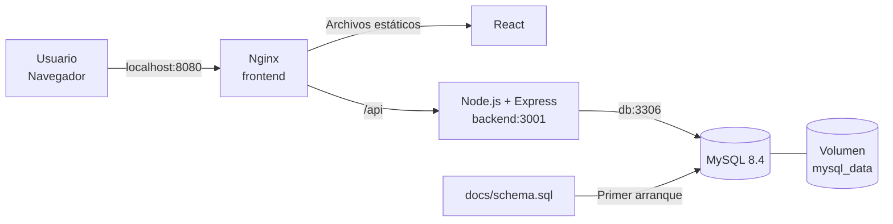

# Docker Repair Equipment System

Sistema web para gestionar clientes, equipos, técnicos, órdenes de reparación,
pagos y usuarios. El objetivo principal de este repositorio es demostrar cómo
una aplicación full stack se divide, construye y ejecuta mediante contenedores
Docker.

## Tecnologías

| Capa | Tecnología | Función |
|---|---|---|
| Frontend | React + Vite | Interfaz web para administradores, clientes, técnicos y recepción |
| Servidor web | Nginx | Publica el frontend y redirige las peticiones `/api` |
| Backend | Node.js + Express | API REST, autenticación y reglas del negocio |
| Base de datos | MySQL 8.4 | Almacenamiento persistente |
| Orquestación | Docker Compose | Construye, conecta y controla los tres servicios |

## Arquitectura Docker



Docker Compose crea una red privada automáticamente. Dentro de ella, cada
contenedor encuentra a los demás por el nombre del servicio:

- El frontend contacta al backend mediante `http://backend:3001`.
- El backend contacta a MySQL mediante `db:3306`.
- Solo Nginx publica un puerto hacia el equipo anfitrión: `8080`.
- MySQL y la API permanecen dentro de la red de Docker.

Esta separación reduce puertos expuestos y evita utilizar direcciones IP
manuales, ya que Docker proporciona DNS interno.

## Estructura relacionada con Docker

```text
.
├── compose.yaml
├── .env.example
├── docs/
│   └── schema.sql
├── backend/
│   ├── Dockerfile
│   └── .dockerignore
└── frontend/
    ├── Dockerfile
    ├── .dockerignore
    └── nginx.conf
```

## Cómo se creó la solución Docker

### 1. Contenedor del backend

El archivo `backend/Dockerfile` parte de `node:22-alpine`.

```dockerfile
FROM node:22-alpine
WORKDIR /app
COPY package*.json ./
RUN npm ci --omit=dev
COPY src ./src
COPY scripts ./scripts
ENV NODE_ENV=production
EXPOSE 3001
CMD ["sh", "-c", "node scripts/seedAdmin.js && exec node src/server.js"]
```

¿Por qué se configuró así?

- `node:22-alpine` ofrece Node.js en una imagen más pequeña que la imagen
  completa.
- `WORKDIR /app` establece una ruta de trabajo clara dentro del contenedor.
- Los archivos `package*.json` se copian antes que el código para reutilizar la
  caché de Docker cuando las dependencias no cambian.
- `npm ci --omit=dev` instala exactamente lo indicado en
  `package-lock.json`, sin dependencias exclusivas de desarrollo.
- `EXPOSE 3001` documenta el puerto usado por Express. No lo publica en el
  computador; la API continúa siendo interna.
- Antes de iniciar la API, `seedAdmin.js` crea el administrador si todavía no
  existe. El script es idempotente, por lo que reiniciar el contenedor no
  duplica el usuario.
- `exec node src/server.js` convierte a Node en el proceso principal y permite
  que reciba correctamente las señales de parada de Docker.

El archivo `backend/.dockerignore` evita enviar `node_modules`, registros,
Git y el archivo local `.env` al contexto de construcción. Esto mejora la
velocidad y evita copiar secretos dentro de la imagen.

### 2. Contenedor del frontend

El archivo `frontend/Dockerfile` utiliza una construcción multietapa.

#### Etapa de compilación

```dockerfile
FROM node:22-alpine AS build
WORKDIR /app
COPY package*.json ./
RUN npm ci
COPY . .
RUN npm run build
```

Node y Vite son necesarios para transformar React en archivos HTML, CSS y
JavaScript optimizados dentro de `dist`.

#### Etapa de ejecución

```dockerfile
FROM nginx:1.27-alpine
COPY nginx.conf /etc/nginx/conf.d/default.conf
COPY --from=build /app/dist /usr/share/nginx/html
EXPOSE 80
```

La imagen final solo contiene Nginx y los archivos compilados. Node, el código
fuente y las dependencias de construcción no pasan a producción. Esto produce
una imagen más pequeña y con menos componentes innecesarios.

El archivo `frontend/.dockerignore` excluye `node_modules`, `dist`,
registros y Git del contexto enviado a Docker.

### 3. Nginx como servidor y proxy inverso

La configuración `frontend/nginx.conf` cumple dos responsabilidades:

1. Servir los archivos estáticos generados por Vite.
2. Redirigir cualquier ruta `/api/` al servicio `backend:3001`.

```nginx
location /api/ {
  proxy_pass http://backend:3001;
}

location / {
  try_files $uri $uri/ /index.html;
}
```

El proxy permite que el navegador use rutas como `/api/auth/login` sin
conocer la dirección interna del backend y evita problemas de direcciones
`localhost` distintas entre contenedores.

`try_files ... /index.html` permite actualizar o abrir directamente una ruta
del frontend sin obtener un error 404, algo necesario en aplicaciones SPA.

### 4. Base de datos MySQL

MySQL usa la imagen oficial `mysql:8.4`. No necesita un Dockerfile propio
porque se puede configurar mediante variables, volúmenes y el script SQL.

Se montan dos volúmenes con propósitos diferentes:

```yaml
volumes:
  - mysql_data:/var/lib/mysql
  - ./docs/schema.sql:/docker-entrypoint-initdb.d/01-schema.sql:ro
```

- `mysql_data` es un volumen nombrado que mantiene los datos aunque el
  contenedor se elimine o se vuelva a crear.
- `schema.sql` es un montaje de solo lectura. La imagen oficial de MySQL
  ejecuta los archivos de `docker-entrypoint-initdb.d` únicamente cuando el
  volumen de datos está vacío.

Por esta razón, cambiar `schema.sql` después del primer arranque no modifica
automáticamente una base existente; para cambios posteriores deben utilizarse
migraciones o recrear el volumen durante una demostración.

### 5. Orquestación con Docker Compose

`compose.yaml` declara tres servicios:

| Servicio | Origen | Puerto | Dependencia |
|---|---|---|---|
| `db` | `mysql:8.4` | Solo interno, 3306 | Ninguna |
| `backend` | `./backend/Dockerfile` | Solo interno, 3001 | MySQL saludable |
| `frontend` | `./frontend/Dockerfile` | `8080:80` | Backend saludable |

La expresión `8080:80` significa que el puerto 8080 del computador se conecta
al puerto 80 de Nginx dentro del contenedor.

Se utiliza `restart: unless-stopped` para reiniciar un servicio si falla,
excepto cuando el usuario lo detiene explícitamente.

### 6. Healthchecks y orden de arranque

`depends_on` por sí solo no garantiza que una aplicación esté lista; solo
indica que su proceso fue iniciado. Por eso se agregaron comprobaciones reales:

- MySQL ejecuta una consulta sobre la tabla `roles`. Así se confirma que el
  motor responde y que el esquema terminó de cargarse.
- El backend consulta `/api/health`, que también ejecuta `SELECT 1` en
  MySQL.
- El frontend solicita la página local de Nginx.

El arranque resultante es:

```text
MySQL inicia y carga schema.sql
          ↓
MySQL queda healthy
          ↓
Backend crea el administrador e inicia Express
          ↓
Backend queda healthy
          ↓
Frontend inicia Nginx y publica el sistema
```

Esto evita que el backend falle por conectarse demasiado pronto a MySQL y que
el frontend se habilite cuando la API todavía no responde.

### 7. Variables de entorno

`.env.example` documenta las variables sin guardar credenciales reales en
Git. Docker Compose admite valores personalizados y valores predeterminados:

```yaml
DB_NAME: ${DB_NAME:-TallerBD}
```

La sintaxis significa: usar `DB_NAME` si está definida; de lo contrario usar
`TallerBD`.

Antes del primer arranque se crea una copia local:

```bash
cp .env.example .env
```

El archivo `.env` está ignorado por Git. En un despliegue real deben cambiarse
`DB_PASS`, `DB_ROOT_PASSWORD`, `JWT_SECRET` y `ADMIN_PASSWORD`.

## Construcción y ejecución

Requisitos:

- Docker Engine
- Docker Compose v2

Desde la raíz del repositorio:

```bash
cp .env.example .env
docker compose up --build -d
```

La opción `--build` reconstruye las imágenes locales y `-d` ejecuta los
contenedores en segundo plano.

Abrir:

<http://localhost:8080>

Credenciales de demostración predeterminadas:

- Correo: `admin@taller.local`
- Contraseña: `Admin1234`

## Verificación

Consultar el estado:

```bash
docker compose ps
```

Los tres servicios deben aparecer como `healthy`.

Probar el frontend:

```bash
curl http://localhost:8080/
```

Probar el recorrido Nginx → backend → MySQL:

```bash
curl http://localhost:8080/api/health
```

Respuesta esperada:

```json
{"ok":true,"db":{"ok":1}}
```

Consultar registros:

```bash
docker compose logs -f
docker compose logs -f backend
```

## Comandos útiles

| Comando | Función |
|---|---|
| `docker compose up --build -d` | Construir e iniciar el proyecto |
| `docker compose ps` | Ver el estado de los servicios |
| `docker compose logs -f` | Seguir los registros |
| `docker compose restart backend` | Reiniciar solo la API |
| `docker compose down` | Detener y eliminar contenedores y red |
| `docker compose down -v` | Eliminar también los datos de MySQL |
| `docker compose build --no-cache` | Reconstruir sin usar caché |

> `docker compose down -v` borra la base de datos persistente. Debe utilizarse
> únicamente cuando se quiera reiniciar la demostración desde cero.

## Flujo de una solicitud

Cuando un usuario inicia sesión ocurre lo siguiente:

1. El navegador envía `POST /api/auth/login` al puerto 8080.
2. Nginx recibe la solicitud y, por comenzar con `/api`, la envía a
   `backend:3001`.
3. Express valida los datos consultando MySQL en `db:3306`.
4. MySQL responde al backend.
5. El backend devuelve la respuesta a Nginx.
6. Nginx entrega la respuesta al navegador.

La base de datos y el backend nunca necesitan publicarse directamente en el
equipo anfitrión.

## Ideas clave para la presentación

- **Imagen:** plantilla inmutable usada para crear contenedores.
- **Contenedor:** instancia en ejecución de una imagen.
- **Dockerfile:** instrucciones para construir una imagen.
- **Docker Compose:** definición declarativa de varios servicios relacionados.
- **Red:** comunicación privada usando nombres de servicio como DNS.
- **Volumen:** almacenamiento que sobrevive al ciclo de vida del contenedor.
- **Proxy inverso:** punto de entrada que recibe y dirige solicitudes.
- **Healthcheck:** prueba automática del estado real de un servicio.
- **Construcción multietapa:** separación entre herramientas de compilación y
  componentes necesarios en producción.
- **Caché de capas:** reutilización de pasos que no cambiaron para acelerar
  futuras construcciones.

## Evolución del trabajo con Docker

El historial Git conserva el proceso por etapas:

1. Creación del esquema de base de datos.
2. Implementación del backend.
3. Implementación del frontend.
4. Incorporación de documentación y evidencias.
5. Laboratorio inicial de bases de datos con Docker Compose.
6. Creación de las imágenes del frontend y backend.
7. Orquestación completa con MySQL.
8. Exclusión de la caché local de Vite.
9. Documentación técnica de la solución Docker.

El laboratorio independiente se conserva en
`DockerComposeClase/docker-compose.yml`; la solución final del sistema utiliza
`compose.yaml` en la raíz.

## Seguridad

La configuración incluida está pensada para desarrollo y demostración. Para
producción se recomienda:

- Utilizar secretos fuertes y no versionarlos.
- Publicar el servicio mediante HTTPS.
- Restringir CORS.
- Ejecutar los procesos con usuarios sin privilegios.
- Fijar versiones y revisar vulnerabilidades de las dependencias.
- Implementar copias de seguridad y migraciones de la base de datos.
