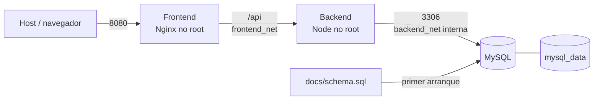

# Arquitectura de la solución

## Objetivo

Ejecutar frontend, API y base de datos de forma reproducible, aislada y con la
menor superficie de red necesaria.

## Vista de contenedores

## Componentes

### Frontend

Nginx es el único servicio con un puerto publicado. Sirve los archivos
compilados de React y funciona como proxy inverso. Su imagen final no contiene
Node.js ni herramientas de compilación.

### Backend

Express concentra autenticación y lógica del negocio. Pertenece a las dos redes:
recibe tráfico del frontend y consulta MySQL. El puerto 3001 está expuesto solo
como documentación de la imagen, no publicado al host.

### Base de datos

MySQL utiliza la imagen oficial 8.4. Solo pertenece a `backend_net`, una red
marcada como interna. El volumen `mysql_data` conserva la información y
`docs/schema.sql` declara el estado inicial.

## Segmentación de redes

| Servicio | frontend_net | backend_net | Puerto al host |
|---|---:|---:|---:|
| frontend | Sí | No | 8080 |
| backend | Sí | Sí | Ninguno |
| db | No | Sí | Ninguno |

Esta topología impide una conexión directa frontend–base de datos y evita
publicar MySQL o Express. Todo acceso externo entra por Nginx.

## Garantías de arranque

1. MySQL inicia, crea la base y ejecuta el esquema.
2. Su healthcheck comprueba que la tabla `roles` puede consultarse.
3. Compose inicia el backend.
4. El backend crea el administrador y su healthcheck consulta MySQL.
5. Compose inicia el frontend.
6. Nginx sirve la interfaz y redirige `/api`.

## Persistencia

El volumen nombrado no desaparece con `docker compose down`. El esquema se
ejecuta solo al inicializar un volumen vacío. Las evoluciones posteriores deben
manejarse con migraciones.

## Decisiones

- **Alpine:** reduce el tamaño respecto a imágenes completas.
- **Multi-stage:** separa construcción y ejecución.
- **Nginx:** sirve archivos estáticos con menor sobrecarga que un servidor de
  desarrollo.
- **Rutas relativas:** eliminan direcciones fijas del navegador.
- **Dos redes:** aplican mínimo acceso entre capas.
- **Healthchecks:** miden disponibilidad, no solo procesos creados.
- **Volumen nombrado:** desacopla los datos del ciclo de vida del contenedor.

## Alcance y camino a producción

La entrega se concentra en contenerización del sistema transaccional. El
almacenamiento compatible con S3 no forma parte de esta implementación. Para
producción también se requieren TLS, gestión externa de secretos, copias de
seguridad, observabilidad, migraciones automatizadas y un registro privado de
imágenes.
